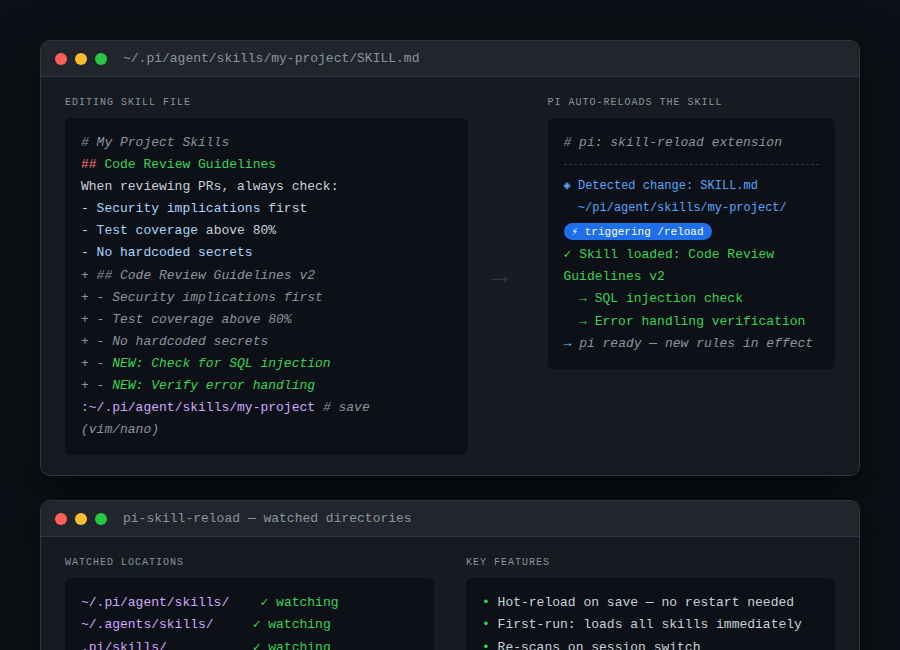

# pi-skill-reload

> **Edit a skill mid-session. pi picks it up automatically — no restart, no /new.**



## Install

```bash
pi install git:github.com/Ola-Turmo/pi-skill-reload
```

Restart pi once to activate. After that, skill changes go live the moment you save.

## What it does

Skills are how you teach pi your code standards, project conventions, and tool setups. But unlike extensions (which reload with `/reload`), skill files were frozen until you closed and reopened pi.

pi-skill-reload fixes that. It watches every `SKILL.md` in your skill directories and triggers a reload on save — whether that's a content edit or a file replacement.

**Watched directories:**

| Location | Scope |
|---|---|
| `~/.pi/agent/skills/` | Global skills |
| `~/.agents/skills/` | Alternative global |
| `.pi/skills/` | Project-local |
| `.agents/skills/` | Alternative project-local |

Works across `/new`, `/resume`, and `/fork` — it re-scans the new working directory on session switches.

## How it works

On first load, it triggers a full skill reload so newly installed skills register immediately. For the rest of the session, it monitors file `change` and `rename` events and fires `/reload` on each skill save.

No config, no commands, no tools — install and forget.

## Requirements

- pi v0.60.0+
- Node.js 18+

## Uninstall

```bash
pi uninstall git:github.com/Ola-Turmo/pi-skill-reload
```

## License

MIT
